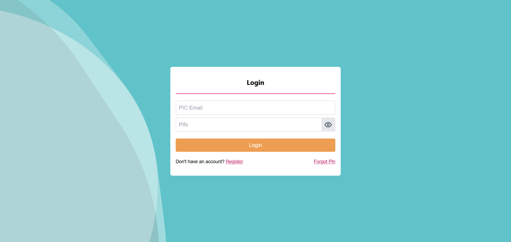
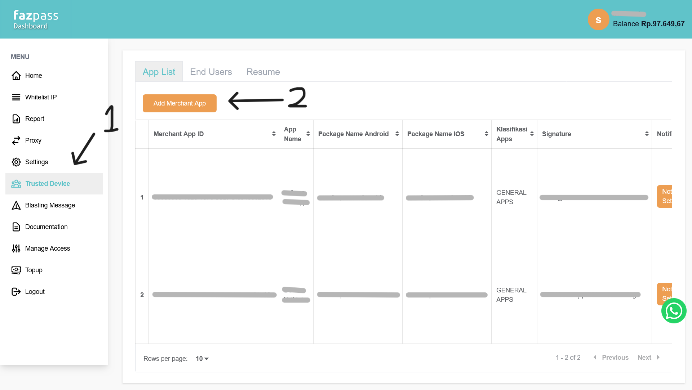
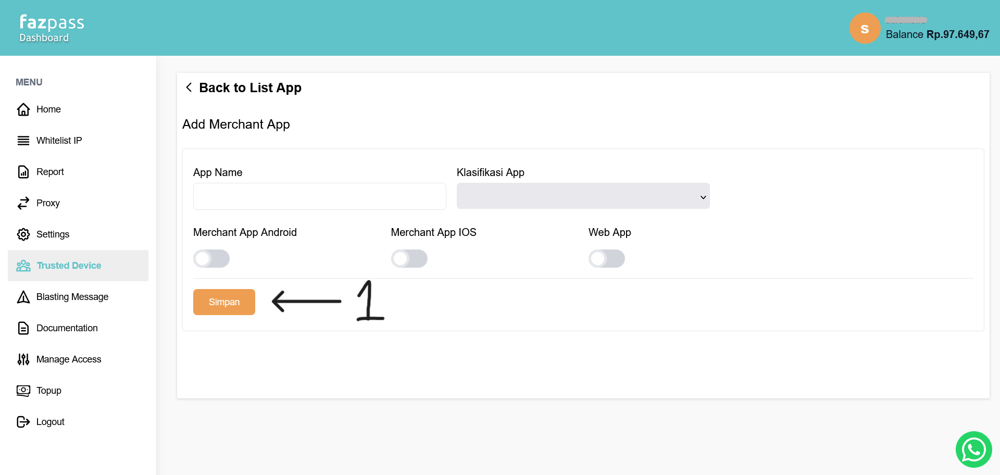
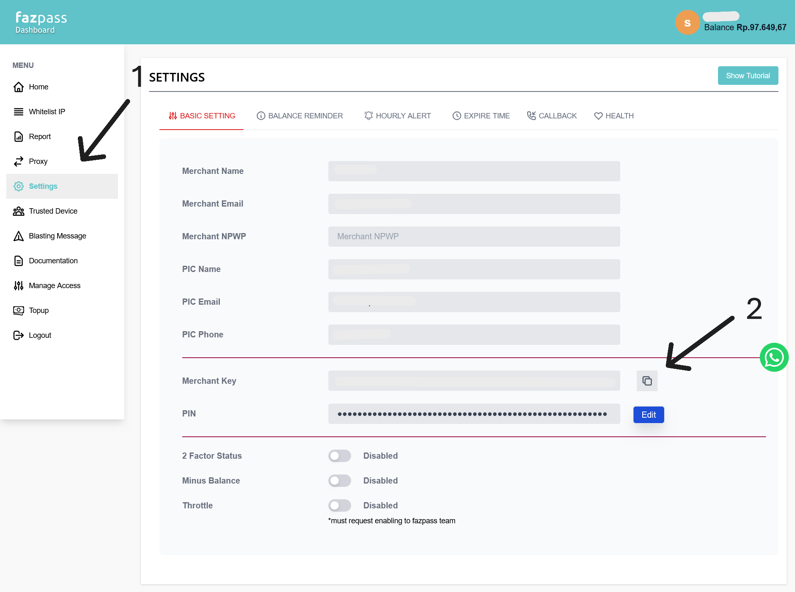
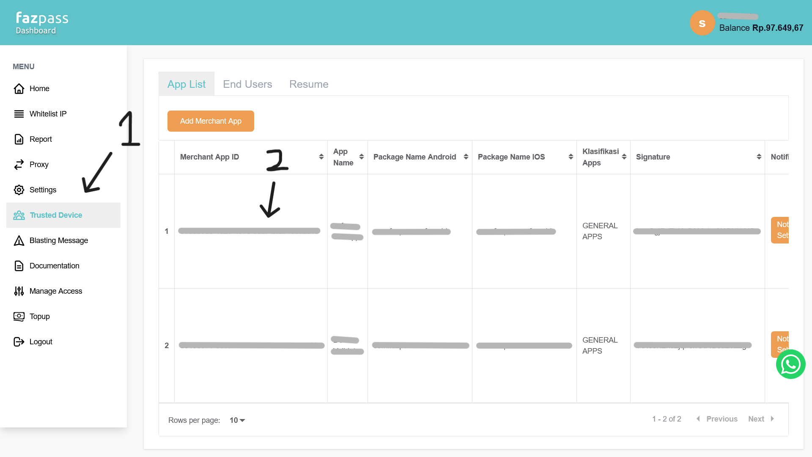

# FIA Documentation (Dashboard)

Documentation on how to use Fazpass Dashboard.

# Getting Started

First, you have to login in the [Fazpass Dashboard](https://dashboard.fazpass.com/login).

# Create a new Merchant App

1. Open the *Trusted Device* menu
2. In the *App List* tab, press the *Add Merchant App* button
3. Fill the app form
4. Press *Save* button

# Retrieve your Merchant Key

1. Open the *Settings* menu
2. In the *Basic Setting* tab, copy the Merchant Key

# Retrieve your Merchant App ID

1. Open the *Trusted Device* menu
2. In the *App List* tab, Pick your app in the table
3. Copy the column *Merchant App Id* value

