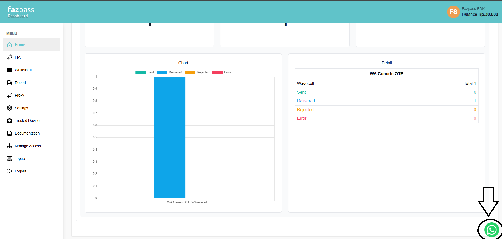
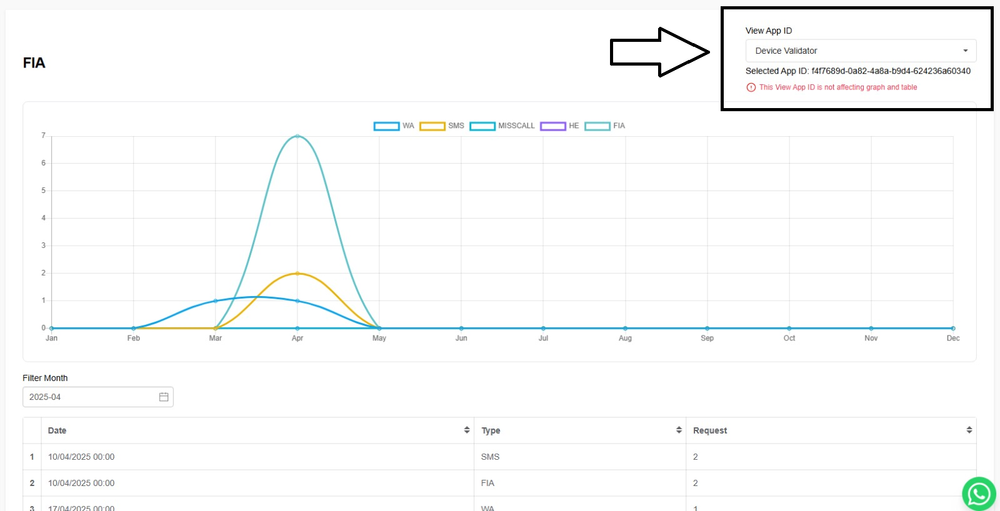
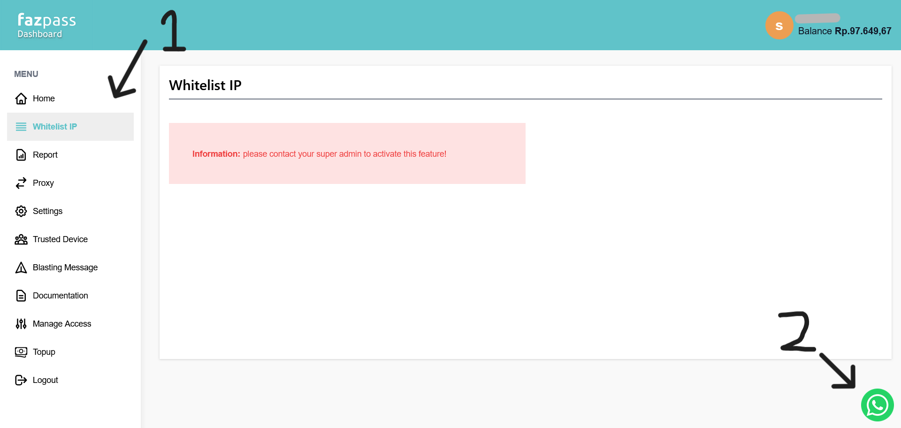

# FIA Documentation (Dashboard)

Documentation on how to use Fazpass Dashboard.

# Getting Started

First, you have to login in the [Fazpass Dashboard](https://dashboard.fazpass.com/login).

# Create a new Merchant App

Please contact our sales/admin for help you create new merchant app

# Retrieve your Merchant Key

1. Open the *Settings* menu
2. In the *Basic Setting* tab, copy the Merchant Key

# Retrieve your Merchant App ID

Access FIA menu yang select your app.

# Whitelist IP

1. Open the *Whitelist IP* menu
2. Contact our admin about whitelist IP by pressing the whatsapp button

