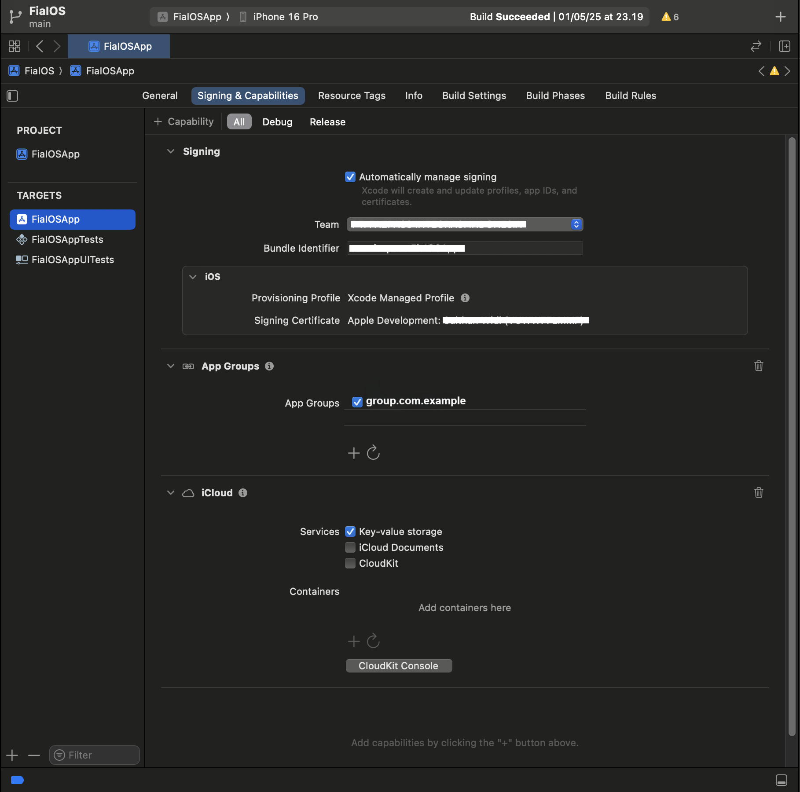

# FIA Documentation (iOS) — Quick Start

Get up and running with FIA iOS SDK in minutes.

For full SDK configuration and customization, see the [Advanced Documentation](README.IOS.ADVANCED.md).

# Installation

You can add this package using Swift Package Manager (SPM) or CocoaPods.

## Using Swift Package Manager (SPM)

1. In Xcode, click **File > Add Packages...**
2. Enter this package URL: `https://github.com/fazpass/fazpass-intelligence-authentication-ios.git`
3. Click **Add Package**

## Using CocoaPods

1. Open your Podfile
2. Add this line inside your target: `pod 'FiaIOS'`
3. Run `pod install`

# Getting Started

Before using this SDK, make sure to get the Merchant Key and Merchant App ID from the Keypaz Dashboard. See the [Dashboard Documentation](README.Dashboard.md#retrieve-your-merchant-key).

In Xcode, add these capabilities under **Signing & Capabilities**:
1. **App Groups** — add container `group.YOUR_INVERTED_DOMAIN`
2. **iCloud** — enable **Key-value storage** service



# Initialize the SDK

Initialize the SDK once before using it.

```swift
import FiaIOS

let fia = FIAFactory.getInstance()

fia.initialize("YOUR_MERCHANT_KEY", "YOUR_MERCHANT_APP_ID", "YOUR_APP_GROUP_ID")
```

# Request OTP with a Premade View

The premade view handles the OTP UI for you. Use this if you don't want to build your own OTP screen.

### 1. Launch the OTP view

Call one of the four methods that fits your use case: `login()`, `register()`, `transaction()`, or `forgetPassword()`.

- `phone` — the user's phone number
- `callback` — fired when OTP validation completes

```swift
fia.otpView().login("PHONE_NUMBER") { tId in
	// If transactionId is nil, OTP validation failed.
	guard let transactionId = tId else {
		// handle failed OTP validation here...
		return
	}

	// with the transactionId, check for the user verified status here...
}
```

### 2. Check for user verified status

With the `transactionId`, see the [Server Documentation](README.Server.md#check-for-user-verified-status) to verify the user.
