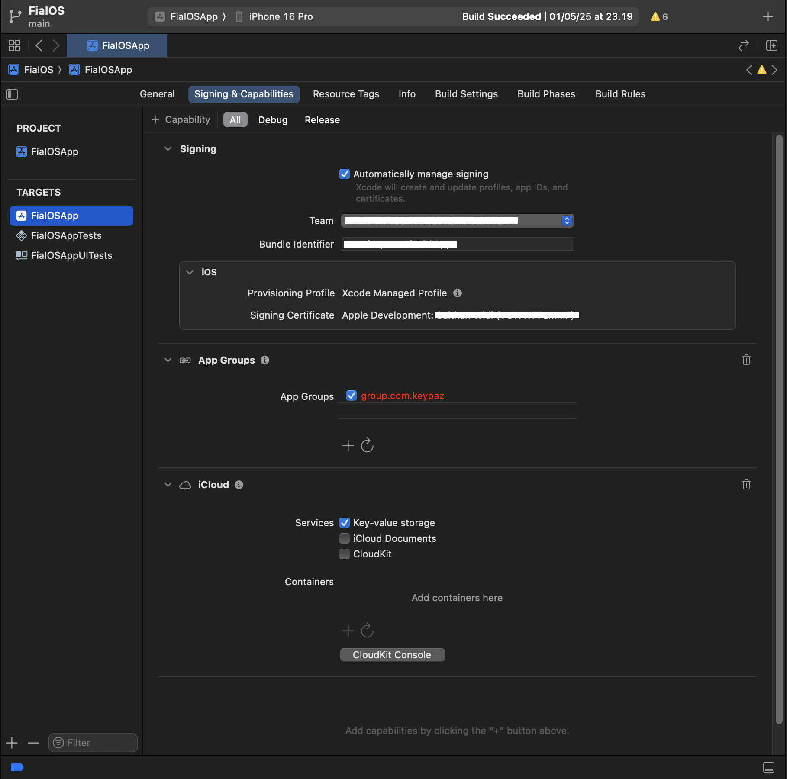

# FIA Documentation (React Native)

Documentation on how to use FIA React Native SDK.

# Installation

You can add this package into your project using npm.

1. run `npm install fia-react`

# Getting Started

Before using this SDK, make sure to get the Merchant Key and Merchant App ID from Keypaz Dashboard. 
Check this [Dashboard Documentation](README.Dashboard.md#retrieve-your-merchant-key).

## Getting Started in IOS

In your XCode, add these capabilities in 'Signing & Capabilities':
1. App Groups (container `group.com.keypaz`)
2. iCloud (service `Key-value storage`)



# Usage

First, you have to initialize the sdk once.

<details>
<summary>Typescript</summary>
 
```tsx
import FIA from "fia-react"

FIA.initialize("YOUR_MERCHANT_KEY", "YOUR_MERCHANT_APP_ID")
```

</details>

## Request and validate OTP

Follow these steps to request and validate your otp.

### 1. Create a public class to hold a static variable of type `OtpPromise`

<details>
<summary>Typescript</summary>

```tsx
import { OtpPromise } from "fia-react"

export class Constants {
	static otpPromise?: OtpPromise
}
```

</details>

### 2. To request for an OTP, call the `otp()` method then pick the method which fits the OTP purpose

For example, we will use the register method.

<details>
<summary>Typescript</summary>

```tsx
import FIA from "fia-react"

FIA.otp().register("PHONE_NUMBER", (promise) => {
	if (promise.hasException) {
		let error = promise.exception
		// handle failed OTP request here...
		return
	}

	Constants.otpPromise = promise
})
```
 
</details>

> [!NOTE]
> When you're finished with the promise, call `Constants.otpPromise!.clean()` to free object from the memory.

### 3. Check which OTP type was being used with `otpPromise.authType`

Here, you can launch between views according to their authentication type as described in the example below.

<details>
<summary>Typescript</summary>

```tsx
import { OtpAuthType } from "fia-react"

switch (Constants.otpPromise!.authType) {
  case OtpAuthType.He:
    // Navigate view to HE view...
    break
  case OtpAuthType.Miscall:
    // Navigate view to Miscall view...
    break
  case OtpAuthType.Message:
    // Navigate view to Message view...
    break
  case OtpAuthType.FIA:
    // Navigate view to FIA view...
    break
}
```
 
</details>

Recently, there are 4 auth type:

#### HE (Header Enrichment)

HE uses network to verify the user. User will not receive an OTP and does not need to input any OTP. Only available if user uses data carrier for internet.

To validate this auth type, call `validateHE()` method. 
First callback will be fired if there is an error. 
Second callback will be fired if validation has been successful.

<details>
<summary>Typescript</summary>

```tsx
Constants.otpPromise!.validateHE(
	(err) => {
		// handle error here...
	},
	() => {
		let transactionId = Constants.otpPromise!.transactionId
		// with the transactionId, check for the user verified status here...
	}
)
```
 
</details>

#### Miscall

This OTP will call user's phone number.

User has to fill the last several digits of the caller's phone number. Digit count can be obtained with `digitCount` property.

To validate this auth type, call `validate()` method and fill the inputted user OTP in the parameter.
First callback will be fired if there is an error.
Second callback will be fired if validation has been successful.

<details>
<summary>Typescript</summary>

```tsx
let digitCount = Constants.otpPromise!.digitCount

Constants.otpPromise!.validate(
  "USER_INPUTTED_OTP",
  (err) => {
    // handle error here...
  },
  () => {
    let transactionId = Constants.otpPromise!.transactionId
    // with the transactionId, check for the user verified status here...
  }
)
```
 
</details>

##### Setup Miscall in Android

In Android, this option only available if user has granted these 2 permissions for miscall autofill:
- Manifest.permission.READ_PHONE_STATE
- Manifest.permission.READ_CALL_LOG

Then, you can listen to miscall like this:

```tsx
Constants.otpPromise!.listenToMiscall(
  (otp) => {
    // called when miscall is read
		// you could call validate() method here
  },
)
```

#### Message

This OTP will send a Message to user's phone number.

User has to fill the OTP sent to their Sms inbox or any messaging service. Digit count can be obtained with `digitCount` property.

To validate this auth type, call `validate()` method and fill the inputted user OTP in the parameter.
First callback will be fired if there is an error.
Second callback will be fired if validation has been successful.

<details>
<summary>Typescript</summary>

```tsx
let digitCount = Constants.otpPromise!.digitCount

Constants.otpPromise!.validate(
	"USER_INPUTTED_OTP",
	(err) => {
		// handle error here...
	},
	() => {
		let transactionId = Constants.otpPromise!.transactionId
		// with the transactionId, check for the user verified status here...
	}
)
```
 
</details>

#### FIA

It's the OTP Intelligence System. User will not receive an OTP and does not need to input any OTP.

This auth type does not need to be validated. Immediately check for user verified status.

### 4. Check for user verified status

Get the `transactionId` like this:

<details>
<summary>Typescript</summary>

```tsx
let transactionId = Constants.otpPromise!.transactionId
```
 
</details>

Then check the [segment down below](#check-for-user-verified-status) on how to check if user has been successfully verified.

# Check for user verified status

A successfully validated OTP DOES NOT mean that the user has also been successfully verified. 
To check for user's verified status, check this [Server Documentation](README.Server.md#check-for-user-verified-status).
